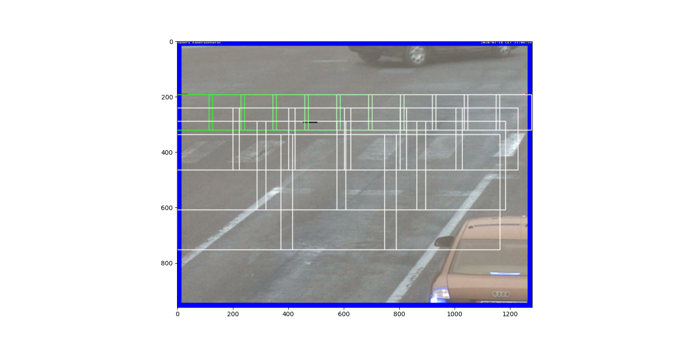

# Vehicle_detection
Entry->[trainSVMFile->extractFeatures[pos+neg]->trainSVM->saveModel]->detector[loadSavedModel->generateSlidingWindows->extractFeatures->standardize->predict->drawBoxes Based On Prediction With Sliding Windows As Reference]->save the coords-> ID generation and tracking.

# HOG-based linear SVM vehicle detection

The files in this repo are a framework I developed for training and utilizing a HOG-based linear SVM to detect vehicles and classify them (LMV or HMV) in a video. 

# Dataset

I have created a custome dataset with vehicle images extracted from the videos captured at two junctions in the country of Bosnia.

.png)

# Project Overview

# Objective

    Extract features from labeled (positive and negative) sample data, split into training and test sets, and finally Train classifier.
    For feature extraction, convert images to grey scale, select the desired channels, then extract HOG, color histogram, and spatial features.
    Detect and draw bounding boxes around objects in a video using a sliding window and smoothed heatmap, and also ID the vehicle detected.
    
   .png)

# Environment and dependencies

This is the environment in which I developed the project and tested the pipeline:

    OpenCV and OpenCV-Python bindings
    Python 3.7
    numpy
    scikit-image 0.14dev
    scikit-learn
    scipy

I developed this project on Win10, and you don't need the latest release of OpenCV.
To extract HOG features, the Descriptor class allows you to select either the scikit-image HOG implementation (skimage.feature.hog) or the OpenCV implementation (cv2.HOGDescriptor). You can also choose whether to extract features from 1, 2, or all 3 image channels. The development version of scikit-image (0.14) is necessary if you wish to use the scikit-image HOG implementation with multiple channels, as previous versions only support single channel images.

Also note that the OpenCV HOG implementation only supports 1, 3, and 4 channel images, not 2 channel images. Furthermore, the OpenCV HOG implementation allows both signed and unsigned gradients, whereas scikit-image only uses unsigned gradients.

# Feature extraction and SVM training

I created a dataset from 150 videos collected from 2 junctions in Sarajevo, Bosnia, with 2594 vehicles at different angles and 2489 images of non-vehicles (road, highway guardrails, etc.), all cropped and resized to 64x64 pixels. HOG, color histogram, and/or spatial features were extracted for each training image.

Feature scaling was done with sklearn.preprocessing.StandardScaler.

The classifier itself was a sklearn.svm.LinearSVC. A number of parameters were tried for the SVC, including penalty, loss function, and regularization parameter. The training set was augmented with misclassifications and the classifier was retrained on this augmented training set before being evaluated on the test set, on which high accuracy (99%) was frequently achieved.

# Sliding Windows

# Performance

.png)
